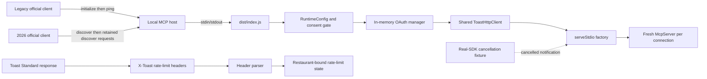

# Phase 1: Local runtime and Standard transport foundation - Research

**Researched:** 2026-08-26  
**Domain:** MCP v2 local stdio compatibility and Toast Standard API rate-limit semantics  
**Confidence:** MEDIUM

<user_constraints>
## User Constraints (from CONTEXT.md)

The following constraints are copied verbatim from `01-CONTEXT.md`. [VERIFIED: repository `.planning/phases/01-local-runtime-and-standard-transport-foundation/01-CONTEXT.md`]

### Locked Decisions

### Existing implementation
- Treat T1-001 through T1-006 and PR #24 as merged implementation evidence.
- Use GitHub and `LOOP.md` as the atomic state authority.
- Do not replace authentic Node 20 and Node 22 execution with validation doubles.

### Protocol compatibility gate
- Scope issue #4 to local stdio behavior only.
- Verify initialization, capability negotiation, independent requests, process restart, reconnect, cancellation, and deterministic missing-state failure.
- Keep Streamable HTTP, remote listeners, and hosted transport out of scope.

### Rate-limit semantics gate
- Accept only current official Toast documentation or sanitized owner-authorized live evidence for issue #32.
- Do not infer `Toast-RateLimit-Reset` semantics from another vendor or header naming.
- Keep issue #32 open as an external release gate if authoritative evidence remains unavailable.

### Publication claim
- Do not mark the package publish-ready from Phase 1 evidence.
- Preserve explicit separation between implemented, validated, reviewed, wired, and externally proven claims.

### the agent's Discretion
- Select the smallest protocol test additions or documentation corrections needed to close issue #4.
- Select the exact evidence format for an unresolved issue #32 external gate.

### Deferred Ideas (OUT OF SCOPE)
- User-facing Standard report tools belong to Phase 3.
- Remote Streamable HTTP needs a separate threat model and authorization design.
- Live Toast evidence needs owner authorization and applicable Merchant consent.
</user_constraints>

<phase_requirements>
## Phase Requirements

| ID | Description | Research Support |
|----|-------------|------------------|
| GH-4 | Prove bounded local stdio initialization, negotiation, independent requests, restart, reconnect, cancellation, and missing-state failure. | Use real child processes and official clients. Add retained-process requests and a real-SDK cancellation fixture. Preserve existing restart and fail-closed tests. [VERIFIED: GitHub issue #4; repository tests] |
| GH-32 | Establish the Toast reset-header contract from an authoritative source. | Current Toast documentation defines `X-Toast-RateLimit-Reset` as an absolute UNIX-epoch timestamp. It defines `Retry-After` as seconds on 429 responses. [CITED: https://doc.toasttab.com/doc/devguide/apiRateLimiting.html] |
| PH1-PUB | Keep publication claims separate from Phase 1 proof. | Phase 1 has no registered reporting tools. Therefore, it cannot prove the full user-facing production chain. [VERIFIED: repository `src/server.ts`; repository `.planning/ROADMAP.md`] |
</phase_requirements>

## Summary

The merged runtime already uses the official MCP v2 `serveStdio(factory)` boundary. It serves legacy 2025 clients and pinned 2026-07-28 clients. It also fails closed on missing consent or configuration. [VERIFIED: repository `src/index.ts`, `src/stdio.ts`, and `test/server.test.ts`; GitHub PR #24]

The remaining issue #4 gap is proof quality, not a runtime rebuild. Current tests connect each era and restart the process, but they do not send independent requests on the retained modern process. They also do not prove that client cancellation reaches a real handler signal. [VERIFIED: repository `test/server.test.ts` and `test/stdio.test.ts`]

Issue #32 no longer needs live evidence for the absolute-versus-relative decision. Current official Toast documentation states that `X-Toast-RateLimit-Reset` is a UNIX-epoch timestamp. However, the runtime currently reads `Toast-RateLimit-*` names without the required `X-` prefix. [CITED: https://doc.toasttab.com/doc/devguide/apiRateLimiting.html] [VERIFIED: repository `src/transport.ts` and `test/transport.test.ts`]

**Primary recommendation:** Use PR #37 as the fail-closed owner for the official `X-Toast-*` repair and issue #32 closure. After it merges CLEAN, add real child-process protocol proof, run immutable exact-head Node 20 and Node 22 gates, obtain independent review, and close issue #4 with exact evidence. Do not duplicate PR #37 in the Phase 1 branch. [VERIFIED: repository constraints and identified gaps]

## Architectural Responsibility Map

| Capability | Primary Tier | Secondary Tier | Rationale |
|------------|-------------|----------------|-----------|
| Process configuration and consent gate | Local runtime | MCP server | Startup must fail before serving stdio when required state is absent. [VERIFIED: repository `src/index.ts` and `src/config.ts`] |
| Protocol negotiation and cancellation | MCP SDK transport | Local runtime | The official client and `serveStdio(factory)` own wire-era negotiation and cancellation delivery. [CITED: https://github.com/modelcontextprotocol/typescript-sdk/blob/main/docs/serving/stdio.md] |
| Standard API request and rate-limit state | Toast transport | Local runtime | `ToastHttpClient` owns response-header parsing, waits, retries, and location-bound limiter state. [VERIFIED: repository `src/transport.ts`] |
| Protocol compatibility proof | Test process | MCP SDK transport | The proof must spawn the built executable through the official stdio client. [CITED: https://github.com/modelcontextprotocol/typescript-sdk/blob/main/docs/serving/stdio.md] |
| Publication disposition | GSD/GitHub evidence | Repository docs | GitHub and `LOOP.md` own atomic state. The ROADMAP only projects outcomes. [VERIFIED: repository `AGENTS.md` and `.planning/ROADMAP.md`] |

## Project Constraints (from AGENTS.md)

| Area | Binding directives |
|------|--------------------|
| Product and data | Keep the server public, local, read-only, and unofficial. Use no real Merchant Data. Keep guest-linked data excluded. Require documented Merchant consent before AI processing. Never use Toast data for model improvement. [VERIFIED: repository `AGENTS.md`] |
| Credentials and isolation | Never persist or expose credentials. Bind every Toast request and rate-limit key to a restaurant GUID, except a separately reviewed credential-scoped allowlist. Never share location state. [VERIFIED: repository `AGENTS.md`] |
| Runtime and transport | Use TypeScript on Node 20 or later. Use MCP SDK v2 packages without mixing SDK generations. Serve stdio through `serveStdio(factory)`. Keep remote HTTP out of scope. [VERIFIED: repository `AGENTS.md`] |
| Transport behavior | Separate authentication, Standard transport, Analytics transport, pagination, normalization, calculation, and MCP presentation. Use bounded backoff, endpoint-specific pagination, cancellation, and explicit incomplete states. [VERIFIED: repository `AGENTS.md`] |
| Delivery and evidence | Read `LOOP.md` before changes. Use authentic locked dependencies. Run local checks. Record exact heads, commands, counts, DOX status, and independent review. Do not use GitHub Actions or weaken tests. [VERIFIED: repository `AGENTS.md`] |

## Standard Stack

This phase must preserve the reviewed lockfile. It needs no new package. [VERIFIED: repository `package.json`, `package-lock.json`, and GitHub PR #24]

### Core

| Library | Version | Publish date | Purpose | Why Standard |
|---------|---------|--------------|---------|--------------|
| `@modelcontextprotocol/server` [WARNING: legitimacy seam flags the package as too new; preserve the reviewed exact lock.] | 2.0.0 | 2026-07-27 | Official local MCP server and `serveStdio(factory)`. | The repository contract requires this SDK generation. [CITED: https://github.com/modelcontextprotocol/typescript-sdk/blob/main/docs/serving/stdio.md] [VERIFIED: npm registry and repository lockfile] |
| `@modelcontextprotocol/client` [WARNING: legitimacy seam flags the package as too new; preserve the reviewed exact lock.] | 2.0.0 | 2026-07-27 | Test-only official legacy and modern stdio clients. | It proves protocol behavior without a validation double. [CITED: https://github.com/modelcontextprotocol/typescript-sdk/blob/main/docs/protocol-versions.md] [VERIFIED: npm registry and repository lockfile] |
| `zod` | 4.4.3 | 2026-05-04 | Runtime input validation. | The existing runtime and SDK use the locked validator. [VERIFIED: npm registry and repository lockfile] |

### Supporting

| Library | Version | Publish date | Purpose | When to Use |
|---------|---------|--------------|---------|-------------|
| `typescript` | 6.0.3 | 2026-04-16 | Build and static checks. | Use through existing npm scripts only. [VERIFIED: npm registry and repository lockfile] |
| `@types/node` [WARNING: legitimacy seam flags the current package family as too new; preserve the reviewed exact lock.] | 20.19.43 | 2026-06-10 | Node 20 type surface. | Use through existing compilation only. [VERIFIED: npm registry and repository lockfile] |
| `node:test` | Node 20 and Node 22 built-in | — | Protocol and transport tests. | Use for all Phase 1 additions. [VERIFIED: repository `test/**/*.test.ts` and `scripts/run-tests.mjs`] |

### Alternatives Considered

| Instead of | Could Use | Tradeoff |
|------------|-----------|----------|
| Official stdio child-process clients | In-memory transport | Reject. Official SDK guidance limits in-memory compatibility coverage to legacy behavior. [CITED: https://github.com/modelcontextprotocol/typescript-sdk/blob/main/docs/serving/stdio.md] |
| `serveStdio(factory)` | Direct `StdioServerTransport` wiring | Reject. Direct wiring can bypass the reviewed dual-era boundary. [CITED: https://github.com/modelcontextprotocol/typescript-sdk/blob/main/docs/migration/support-2026-07-28.md] |
| Existing Node test runner | A new test framework | Reject. A new framework adds dependency risk without closing a proof gap. [VERIFIED: repository test infrastructure]

**Installation:** Restore only the authentic lockfile graph. [VERIFIED: repository `package-lock.json`]

```bash
npm ci --no-audit --no-fund
```

## Package Legitimacy Audit

The audit uses the GSD package-legitimacy seam, the npm registry, official SDK documentation, and postinstall checks. No audited package defines a registry `postinstall` script. [VERIFIED: package-legitimacy seam and npm registry]

| Package | Registry | Age signal | Weekly downloads | Source repo | Verdict | Disposition |
|---------|----------|------------|------------------|-------------|---------|-------------|
| `@modelcontextprotocol/server` | npm | Stable 2.0.0 published 2026-07-27 | 4,757,513 | `modelcontextprotocol/typescript-sdk` | SUS: too new | Existing exact lock approved by PR #24; add a human checkpoint before any version change. [VERIFIED: package-legitimacy seam; GitHub PR #24] |
| `@modelcontextprotocol/client` | npm | Stable 2.0.0 published 2026-07-27 | 3,526,917 | `modelcontextprotocol/typescript-sdk` | SUS: too new | Test-only exact lock approved by PR #24; add a human checkpoint before any version change. [VERIFIED: package-legitimacy seam; GitHub PR #24] |
| `zod` | npm | Registry created 2020-03-07 | 272,031,420 | `colinhacks/zod` | OK | Approved. [VERIFIED: package-legitimacy seam] |
| `typescript` | npm | Established package; pinned 6.0.3 published 2026-04-16 | 274,292,179 | `microsoft/TypeScript` | OK | Approved. [VERIFIED: package-legitimacy seam and npm registry] |
| `@types/node` | npm | Existing family; seam examined the current release | 425,533,259 | `DefinitelyTyped/DefinitelyTyped` | SUS: too new | Preserve 20.19.43; add a human checkpoint before any version change. [VERIFIED: package-legitimacy seam and repository lockfile] |

**Packages removed due to SLOP verdict:** none. [VERIFIED: package-legitimacy seam]  
**Packages flagged as suspicious:** `@modelcontextprotocol/server`, `@modelcontextprotocol/client`, and `@types/node`. [VERIFIED: package-legitimacy seam]

Routine `npm ci` must restore the already reviewed exact lock. Any dependency selection or lockfile change needs a fresh human verification checkpoint. [VERIFIED: GitHub PR #24; repository `AGENTS.md`]

## Architecture Patterns

### System Architecture Diagram

The diagram shows the current production chain and the two remaining proof seams. [VERIFIED: repository source and tests]



### Recommended Project Structure

```text
src/
├── index.ts                 # unchanged production startup chain
├── server.ts                # unchanged empty Phase 1 MCP server
├── stdio.ts                 # unchanged serveStdio boundary
└── transport.ts             # unchanged here; prerequisite PR #37 owns the X-Toast repair
test/
├── server.test.ts           # retained-process requests and reconnect proof
├── transport.test.ts        # official header names and boundary behavior
└── fixtures/                # minimal real-SDK cancellable stdio fixture, if needed
docs/research/
└── toast-api-reporting-landscape.md # replace the resolved reset assumption
```

The Phase 1 branch changes only protocol proof. Prerequisite PR #37 changes the incorrect header contract. Neither slice rebuilds closed T1 behavior. [VERIFIED: repository layout and Phase 1 constraints]

### Pattern 1: Retained-process protocol proof

**What:** Connect through `StdioClientTransport`, capture the child PID, send two sequential requests and two concurrent requests, and verify the PID stays constant. [VERIFIED: local executable research probe]

**When to use:** Use legacy `ping` after the legacy initialization handshake. Use `discover()` on the retained modern connection because modern 2026 has no required initialize handshake and does not define `ping` as the compatibility request. [CITED: https://github.com/modelcontextprotocol/typescript-sdk/blob/main/docs/protocol-versions.md] [CITED: https://github.com/modelcontextprotocol/typescript-sdk/blob/main/docs/migration/support-2026-07-28.md]

**Research result:** The built executable accepted repeated and concurrent legacy `ping()` requests on one PID. It also accepted repeated and concurrent modern `discover()` requests on one retained PID. [VERIFIED: local executable probe on 2026-08-26]

```typescript
// Source pattern: official MCP SDK stdio and protocol-version documentation.
await client.connect(transport);
const pid = transport.pid;
await client.discover();
await client.discover();
await Promise.all([client.discover(), client.discover()]);
assert.equal(transport.pid, pid);
```

### Pattern 2: Cancellation through the real SDK boundary

**What:** Start a controlled child-process server with `serveStdio(factory)`. Register one synthetic wait tool. Abort the official client request. Assert that `ctx.mcpReq.signal` aborts and no result follows. Then send another supported request on the same process. [CITED: https://github.com/modelcontextprotocol/typescript-sdk/blob/main/examples/streaming/server.ts] [CITED: https://github.com/modelcontextprotocol/modelcontextprotocol/blob/main/docs/specification/2026-07-28/basic/transports/stdio.mdx]

**When to use:** Use this fixture only for protocol cancellation proof because the Phase 1 production server intentionally has no tools. Carry production Toast-handler cancellation proof into the first wired report tool. [VERIFIED: repository `src/server.ts` and `.planning/ROADMAP.md`]

```typescript
// Source pattern: official SDK streaming example and ServerContext signal API.
server.registerTool("phase1_wait", {}, async (ctx) => {
  await new Promise<never>((_resolve, reject) => {
    ctx.mcpReq.signal.addEventListener(
      "abort",
      () => reject(ctx.mcpReq.signal.reason),
      { once: true },
    );
  });
});
```

The fixture must use the official server, client, and stdio transport. A fake transport callback does not satisfy GH-4. [VERIFIED: repository Phase 1 constraints]

### Pattern 3: Official Toast header contract

**What:** Parse `X-Toast-RateLimit-Limit`, `X-Toast-RateLimit-Remaining`, and `X-Toast-RateLimit-Reset`. Treat reset as an absolute UNIX-epoch timestamp. Treat 429 `Retry-After` as seconds until reset. [CITED: https://doc.toasttab.com/doc/devguide/apiRateLimiting.html]

**When to use:** Apply the names to both restaurant-scoped and allowlisted credential-scoped transport paths. Preserve location-key isolation and wait ceilings. [VERIFIED: repository `src/transport.ts` and `AGENTS.md`]

```typescript
const resetAtEpochMs = epochHeader(
  response,
  "x-toast-ratelimit-reset",
);
```

Header lookup is case-insensitive, but omitting `X-` selects a different header field. [VERIFIED: Fetch `Headers` behavior and repository code inspection]

### Pattern 4: Evidence-state separation

**What:** Record implementation, exact-head validation, independent review, runtime wiring, and external proof as separate fields. [VERIFIED: repository `AGENTS.md` and `.planning/ROADMAP.md`]

**When to use:** Use this format in issues #4 and #32, the owning PR, `LOOP.md`, and Phase 1 state reconciliation. [VERIFIED: repository GSD bridge]

### Anti-Patterns to Avoid

- **Connection-only modern proof:** A pinned `connect()` can use a disposable probe process. Send supported requests on the retained process. [CITED: https://github.com/modelcontextprotocol/typescript-sdk/blob/main/docs/serving/stdio.md]
- **Capability-short-circuited request proof:** `listTools()` returns an empty list locally when no tools capability exists. It does not prove a wire request. [VERIFIED: local executable probe and SDK client source]
- **Modern `ping()` proof:** The 2026-era protocol does not use the legacy ping operation. Use retained `discover()` requests. [CITED: https://github.com/modelcontextprotocol/typescript-sdk/blob/main/docs/protocol-versions.md]
- **Unit seam as executable proof:** The injected `fakeServe` tests sanitize error handling, but they do not prove real wire cancellation. [VERIFIED: repository `test/stdio.test.ts`]
- **Header-name approximation:** `Toast-RateLimit-*` without `X-` does not match the current official Toast fields. [CITED: https://doc.toasttab.com/doc/devguide/apiRateLimiting.html] [VERIFIED: repository `src/transport.ts`]

## Don't Hand-Roll

| Problem | Don't Build | Use Instead | Why |
|---------|-------------|-------------|-----|
| Dual-era stdio negotiation | A custom JSON-RPC era switch | Official `serveStdio(factory)` and official clients | The SDK owns legacy initialization, modern discovery, and connection pinning. [CITED: https://github.com/modelcontextprotocol/typescript-sdk/blob/main/docs/migration/support-2026-07-28.md] |
| Cancellation framing | A custom stdin cancellation message | Official client abort plus `ctx.mcpReq.signal` | The stdio specification defines `notifications/cancelled` and request-ID binding. [CITED: https://github.com/modelcontextprotocol/modelcontextprotocol/blob/main/docs/specification/2026-07-28/basic/transports/stdio.mdx] |
| Rate-limit scheduler | A second limiter or timer system | Existing `ToastHttpClient` retry and wait code | The current implementation already owns bounded waits and location-bound state. [VERIFIED: repository `src/transport.ts`] |
| Lockfile | A hand-edited dependency graph | `npm ci` and npm-generated `package-lock.json` | Repository rules require authentic package restoration. [VERIFIED: repository `AGENTS.md`] |
| Publication signal | A single green-test label | GSD five-state evidence model | Tests alone do not prove report wiring or live compatibility. [VERIFIED: repository `.planning/ROADMAP.md`]

**Key insight:** Phase 1 needs better evidence and one header repair. It does not need a new transport abstraction. [VERIFIED: repository and official-source comparison]

## Common Pitfalls

### Pitfall 1: Treating modern connect as a retained-process request

**What goes wrong:** A test proves negotiation but not independent requests on the process that remains connected. [CITED: https://github.com/modelcontextprotocol/typescript-sdk/blob/main/docs/serving/stdio.md]  
**Why it happens:** The stdio client can probe through a disposable sibling process before it starts the caller connection. [CITED: https://github.com/modelcontextprotocol/typescript-sdk/blob/main/docs/serving/stdio.md]  
**How to avoid:** Capture the retained PID and send sequential and concurrent `discover()` requests after connect. [VERIFIED: local executable probe]  
**Warning sign:** The test only checks server identity and capability fields after `connect()`. [VERIFIED: repository `test/server.test.ts`]

### Pitfall 2: Testing cancellation without an active handler

**What goes wrong:** The test aborts a client promise but never proves the server handler received the cancellation signal. [VERIFIED: SDK server context contract]  
**Why it happens:** The Phase 1 production server has no registered tools. [VERIFIED: repository `src/server.ts`]  
**How to avoid:** Use one controlled synthetic real-SDK handler and observe `ctx.mcpReq.signal`. Then prove the process accepts another request. [CITED: https://github.com/modelcontextprotocol/typescript-sdk/blob/main/examples/streaming/server.ts]  
**Warning sign:** The test uses `fakeServe`, an in-memory transport, or only `AbortController.signal.aborted`. [VERIFIED: repository constraints]

### Pitfall 3: Closing issue #32 without repairing the prefix

**What goes wrong:** Documentation says the ambiguity is resolved, but production code still ignores the official header names. [CITED: https://doc.toasttab.com/doc/devguide/apiRateLimiting.html] [VERIFIED: repository `src/transport.ts`]  
**Why it happens:** Existing tests use the same non-`X-` names as the implementation. [VERIFIED: repository `test/transport.test.ts`]  
**How to avoid:** Change code and fixtures to current official names. Add a negative test that non-official approximations do not set state. [VERIFIED: identified contract gap]  
**Warning sign:** The owning PR changes only the research note or GitHub comment. [VERIFIED: Phase 1 completion criteria]

### Pitfall 4: Hiding exact-head gaps behind a broad green command

**What goes wrong:** A command passes while new test files are not discovered or one Node floor is skipped. [VERIFIED: repository delivery rules]  
**Why it happens:** The suite runner discovers files dynamically, and local version managers can select the wrong runtime. [VERIFIED: repository `scripts/run-tests.mjs` and local environment]  
**How to avoid:** Record the Node binary version, discovered file count, test count, package count, and exact SHA for both Node 20 and Node 22. [VERIFIED: PR #24 evidence pattern]  
**Warning sign:** Evidence reports only `npm test` or only the shell default Node version. [VERIFIED: repository delivery rules]

## Code Examples

### Verify two protocol eras without a capability shortcut

```typescript
// Legacy path: initialize during connect, then retained-process requests.
await legacyClient.connect(legacyTransport);
await legacyClient.ping();
await legacyClient.ping();

// Modern path: discover during connect, then retained-process requests.
await modernClient.connect(modernTransport);
await modernClient.discover();
await modernClient.discover();
```

The method split follows the official SDK protocol-version model. [CITED: https://github.com/modelcontextprotocol/typescript-sdk/blob/main/docs/protocol-versions.md]

### Verify cancellation and continued process use

```typescript
const controller = new AbortController();
const pending = client.callTool(
  { name: "phase1_wait", arguments: {} },
  { signal: controller.signal },
);

controller.abort("phase1 cancellation proof");
await assert.rejects(pending);
await client.discover();
```

The server fixture must separately assert that `ctx.mcpReq.signal` aborted. The post-cancel request proves the shared stdio process remains usable. [CITED: https://github.com/modelcontextprotocol/modelcontextprotocol/blob/main/docs/specification/2026-07-28/basic/transports/stdio.mdx]

### Parse the current Toast reset contract

```typescript
const snapshot = Object.freeze({
  limit: numericHeader(response, "x-toast-ratelimit-limit"),
  remaining: numericHeader(response, "x-toast-ratelimit-remaining"),
  resetAtEpochMs: epochHeader(response, "x-toast-ratelimit-reset"),
});
```

The field names and absolute-reset meaning come from current Toast documentation. [CITED: https://doc.toasttab.com/doc/devguide/apiRateLimiting.html]

## State of the Art

| Old Approach | Current Approach | When Changed | Impact |
|--------------|------------------|--------------|--------|
| Legacy `initialize` plus `initialized` for every client | Legacy initialization remains for 2025 clients; modern 2026 uses per-request metadata and optional discovery | Protocol revision 2026-07-28 | Tests must use era-specific operations and must not require a modern initialize handshake. [CITED: https://github.com/modelcontextprotocol/typescript-sdk/blob/main/docs/protocol-versions.md] |
| Direct single-era stdio wiring | `serveStdio(factory)` with a fresh server instance per connection | MCP TypeScript SDK v2 | One reviewed boundary can serve legacy and modern local clients. [CITED: https://github.com/modelcontextprotocol/typescript-sdk/blob/main/docs/migration/support-2026-07-28.md] |
| Unsourced `Toast-RateLimit-Reset` assumption | Documented `X-Toast-RateLimit-Reset` absolute UNIX-epoch contract | Current Toast documentation, verified 2026-08-26 | Issue #32 can close after implementation and exact-head evidence. [CITED: https://doc.toasttab.com/doc/devguide/apiRateLimiting.html] |

**Deprecated or outdated:**

- The research note that says no primary source defines reset semantics is outdated. Replace it with the current Toast contract and retrieval date. [VERIFIED: repository `docs/research/toast-api-reporting-landscape.md`] [CITED: https://doc.toasttab.com/doc/devguide/apiRateLimiting.html]
- The non-`X-` header fixtures are outdated. Replace them with current official names. [VERIFIED: repository `test/transport.test.ts`] [CITED: https://doc.toasttab.com/doc/devguide/apiRateLimiting.html]

## Assumptions Log

| # | Claim | Section | Risk if Wrong |
|---|-------|---------|---------------|
| — | No `[ASSUMED]` claim remains. | All sections | No user confirmation is required for a stack or semantics choice. [VERIFIED: research source audit] |

## Resolved Questions

1. **RESOLVED — What exact UNIX-epoch unit does Toast send?**
   - What we know: Toast documents an absolute UNIX-epoch timestamp. [CITED: https://doc.toasttab.com/doc/devguide/apiRateLimiting.html]
   - Resolution: The cited page does not state seconds or milliseconds. Preserve the bounded absolute seconds-or-milliseconds parser. Remove the relative-value assumption. Require boundary tests for both accepted encodings. [VERIFIED: official page inspection on 2026-08-26 and repository `epochHeader` behavior]

2. **RESOLVED — Does Phase 1 prove production report cancellation?**
   - What we know: The Phase 1 server has no report handler to cancel. [VERIFIED: repository `src/server.ts`]
   - Resolution: Phase 1 closes only local protocol cancellation in #4. Phase 3 owns production report cancellation through real Toast fetch and page-fold paths. [VERIFIED: repository `.planning/ROADMAP.md`]

## Environment Availability

| Dependency | Required By | Available | Version | Fallback |
|------------|-------------|-----------|---------|----------|
| Node.js | Supported runtime gates | Yes | 20.20.2, 22.22.2, 25.9.0 | Use exact Node 20 and Node 22 binaries for the gate. [VERIFIED: local runtime probe] |
| npm | Authentic lock restoration | Yes | 11.12.1 under the shell default runtime | Use the npm paired with each selected Node binary. [VERIFIED: local runtime probe] |
| GitHub CLI | Issue, PR, and review evidence | Yes | 2.89.0 | Use GitHub web/API only if CLI access fails. [VERIFIED: local CLI probe] |
| npm registry access | `npm ci`, version, and legitimacy checks | Yes | Registry reachable | Stop and keep the gate open if authentic restoration fails. [VERIFIED: successful `npm ci` and registry queries] |
| Authorized Toast credentials | Live verification | Not used | — | Official Toast documentation resolves GH-32 without live Merchant Data. [CITED: https://doc.toasttab.com/doc/devguide/apiRateLimiting.html] |

**Missing dependencies with no fallback:** none for the planned local proof. [VERIFIED: environment audit]  
**Missing dependencies with fallback:** live Toast access is unnecessary for GH-32 because an authoritative current source exists. [CITED: https://doc.toasttab.com/doc/devguide/apiRateLimiting.html]

## Validation Architecture

### Test Framework

| Property | Value |
|----------|-------|
| Framework | Node built-in test runner on Node 20.20.2 and Node 22.22.2. [VERIFIED: repository scripts and local runtimes] |
| Config file | No separate test config; `scripts/run-tests.mjs` discovers compiled `*.test.js` files. [VERIFIED: repository `scripts/run-tests.mjs`] |
| Quick run command | `npm run build && node --test --test-concurrency=1 test-dist/test/server.test.js test-dist/test/transport.test.js` [VERIFIED: repository scripts and compiled layout] |
| Full suite command | `npm ci --no-audit --no-fund && npm run check` under each exact Node runtime. [VERIFIED: repository `package.json` and PR #24 gate pattern] |

The current source baseline passed `npm run check` on Node 20.20.2 and Node 22.22.2. Each run discovered 12 test files, passed 186 tests, and packed 35 files. These results do not close the missing GH-4 and GH-32 proof. [VERIFIED: local authentic validation on 2026-08-26]

### Phase Requirements to Test Map

| Req ID | Behavior | Test Type | Automated Command | File Exists? |
|--------|----------|-----------|-------------------|-------------|
| GH-4-INIT | Legacy initialization and pinned modern negotiation | Child-process integration | `npm run build && node --test test-dist/test/server.test.js` | Yes; strengthen retained-process assertions. [VERIFIED: repository `test/server.test.ts`] |
| GH-4-REQ | Two sequential and two concurrent requests on one process for each era | Child-process integration | `npm run build && node --test test-dist/test/server.test.js` | No; Wave 0 addition. [VERIFIED: test gap audit] |
| GH-4-RESTART | Close, respawn, reconnect, and use a different PID without hidden state | Child-process integration | `npm run build && node --test test-dist/test/server.test.js` | Yes; add a post-reconnect request. [VERIFIED: repository `test/server.test.ts`] |
| GH-4-CANCEL | Client abort reaches `ctx.mcpReq.signal`; process accepts another request | Child-process integration | `npm run build && node --test test-dist/test/protocol-cancellation.test.js` | No; Wave 0 fixture and test. [VERIFIED: test gap audit] |
| GH-4-MISSING | Missing consent or all configuration fails nonzero, writes no stdout protocol data, and leaks no secret | Child-process negative | `npm run build && node --test test-dist/test/server.test.js` | Yes. [VERIFIED: repository `test/server.test.ts`] |
| GH-32-HEADERS | Official `X-Toast-*` names populate rate-limit state | Unit and transport integration | `npm run build && node --test test-dist/test/transport.test.js` | Existing tests use wrong names; repair required. [VERIFIED: repository `test/transport.test.ts`] |
| GH-32-BOUND | Absolute reset, zero remaining, past reset, seconds, milliseconds, invalid values, and wait ceiling | Unit and negative | `npm run build && node --test test-dist/test/transport.test.js` | Partial; rename fixtures and add prefix-negative coverage. [VERIFIED: repository `test/transport.test.ts`] |

### Sampling Rate

- **Per task commit:** Run the focused server or transport test file after `npm run build`. [VERIFIED: repository test layout]
- **Per wave merge:** Run `npm run check` on the selected Node 20 and Node 22 binaries. [VERIFIED: repository delivery contract]
- **Phase gate:** Restore with `npm ci`, run both full checks, record discovered files/tests/package files, obtain a fresh exact-head independent CLEAN review, and verify main after merge. [VERIFIED: repository `AGENTS.md` and `LOOP.md`]

### Wave 0 Gaps

- [ ] Add retained-process sequential and concurrent protocol requests to `test/server.test.ts`. [VERIFIED: GH-4 gap]
- [ ] Add a minimal child-process cancellation fixture and `test/protocol-cancellation.test.ts`. [VERIFIED: GH-4 gap]
- [ ] External prerequisite PR #37 updates `test/transport.test.ts` to official `X-Toast-*` names, preserves bounded absolute seconds-or-milliseconds parsing, and adds non-official-prefix negative coverage. The Phase 1 branch does not modify this file. [VERIFIED: GH-32 gap ownership]
- [ ] Update the outdated reset-semantics note and record `DOX: updated`. [VERIFIED: documentation gap]

## Security Domain

### Applicable ASVS Categories

| ASVS Category | Applies | Standard Control |
|---------------|---------|------------------|
| V2 Authentication | Yes | Keep Toast OAuth credentials and bearer tokens in memory. Never log or serialize them. [VERIFIED: repository `AGENTS.md`, `src/auth.ts`, and `src/config.ts`] |
| V3 Session Management | Limited | Stdio owns one local process connection. Restart must create a fresh process without hidden MCP session state. [VERIFIED: repository `test/server.test.ts`] |
| V4 Access Control | Yes | Fail closed before report paths. Preserve explicit restaurant GUID binding for every Standard request and limiter key. [VERIFIED: repository `AGENTS.md` and `src/transport.ts`] |
| V5 Input Validation | Yes | Use existing Zod configuration validation and strict numeric header parsing. Reject invalid or unsafe values. [VERIFIED: repository `src/config.ts` and `src/transport.ts`] |
| V6 Cryptography | Yes | Use platform TLS and OAuth. Do not add custom cryptography in this phase. [VERIFIED: repository architecture contract] |

### Known Threat Patterns for Local Node stdio

| Pattern | STRIDE | Standard Mitigation |
|---------|--------|---------------------|
| Secret capture in child-process output | Information disclosure | Use synthetic credentials, keep stdout protocol-only, sanitize stderr, and assert the marker is absent. [VERIFIED: repository `test/server.test.ts` and `src/stdio.ts`] |
| Cross-location limiter reuse | Information disclosure / elevation | Preserve restaurant GUID in every Standard rate-limit key. [VERIFIED: repository `src/transport.ts` and `AGENTS.md`] |
| Cancellation ignored during long work | Denial of service | Propagate `ctx.mcpReq.signal` into downstream fetch and page-fold work; stop further output after cancellation. [CITED: https://github.com/modelcontextprotocol/modelcontextprotocol/blob/main/docs/specification/2026-07-28/basic/transports/stdio.mdx] |
| Forged or malformed reset header | Denial of service | Parse safe non-negative integers, enforce maximum waits, and fail closed on excessive server delays. [VERIFIED: repository `src/transport.ts`] |
| Remote transport scope expansion | Spoofing / elevation | Keep listeners and Streamable HTTP absent from Phase 1. [VERIFIED: repository `AGENTS.md` and Phase 1 context] |

## Sources

### Primary (HIGH confidence)

- [MCP TypeScript SDK stdio guide](https://github.com/modelcontextprotocol/typescript-sdk/blob/main/docs/serving/stdio.md) — child-process testing, `serveStdio(factory)`, and connection behavior. [CITED: official SDK]
- [MCP TypeScript SDK protocol versions](https://github.com/modelcontextprotocol/typescript-sdk/blob/main/docs/protocol-versions.md) — legacy and modern operation differences. [CITED: official SDK]
- [MCP 2026 migration guide](https://github.com/modelcontextprotocol/typescript-sdk/blob/main/docs/migration/support-2026-07-28.md) — dual-era serving and modern negotiation. [CITED: official SDK]
- [MCP stdio specification](https://github.com/modelcontextprotocol/modelcontextprotocol/blob/main/docs/specification/2026-07-28/basic/transports/stdio.mdx) — cancellation and process termination semantics. [CITED: official specification]
- [MCP SDK streaming example](https://github.com/modelcontextprotocol/typescript-sdk/blob/main/examples/streaming/server.ts) — handler cancellation signal pattern. [CITED: official SDK]
- [Toast API rate limiting](https://doc.toasttab.com/doc/devguide/apiRateLimiting.html) — exact header names and reset semantics. [CITED: official Toast documentation]

### Secondary (MEDIUM confidence)

- Repository `AGENTS.md`, `LOOP.md`, `.planning/ROADMAP.md`, source, tests, package manifests, and GitHub issues #4 and #32. [VERIFIED: local repository and GitHub]
- Local authentic Node 20 and Node 22 checks plus retained-process protocol probes. [VERIFIED: local execution on 2026-08-26]

### Tertiary (LOW confidence)

- None. [VERIFIED: source audit]

## Metadata

**Confidence breakdown:**

- Standard stack: HIGH. The plan preserves the exact reviewed lockfile and adds no package. [VERIFIED: repository and PR #24]
- Architecture: HIGH. The official SDK documents the stdio and protocol boundaries, and repository code matches them. [CITED: official MCP SDK] [VERIFIED: repository source]
- Pitfalls: MEDIUM. Code and official sources verify the gaps, but the new cancellation fixture still needs implementation and exact-head proof. [VERIFIED: research gap analysis]
- Toast header semantics: HIGH for absolute versus relative and header names; MEDIUM for seconds versus milliseconds. [CITED: official Toast documentation]

**Research date:** 2026-08-26  
**Valid until:** 2026-09-25, or earlier if MCP SDK or Toast rate-limit documentation changes. [VERIFIED: fast-moving dependency policy]
